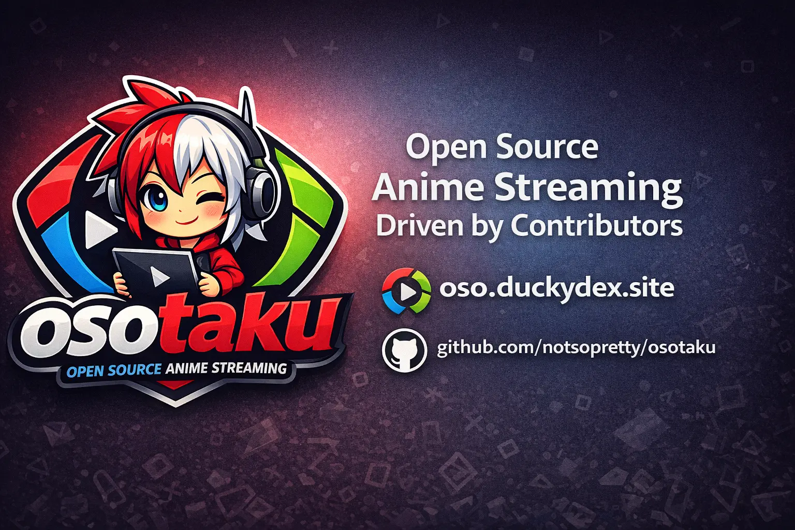

# OsOtaku 🎬

[](LICENSE)
[](CONTRIBUTING.md)
[](https://github.com/notsopreety/OsOtaku)

**OsOtaku** is a free, open-source AniList wrapper for discovering and tracking anime. Built by the community, for the community.



## ⚠️ Important Notice

**OsOtaku does not promote or encourage piracy.** We strongly recommend supporting anime creators by watching content through official, licensed streaming platforms such as [Crunchyroll](https://crunchyroll.com), [Funimation](https://funimation.com), [Netflix](https://netflix.com), and other legal services.

OsOtaku is fundamentally an **AniList wrapper** - an alternative interface for browsing anime data from the AniList API. Community-contributed streaming links are provided for informational purposes and point to third-party services outside our control.

## ✨ Features

- 🔍 **Browse & Search** - Discover anime with powerful search and filters
- 📊 **AniList Integration** - Sync your anime lists and track progress  
- 📱 **Responsive Design** - Beautiful UI on desktop, tablet, and mobile
- 🌙 **Dark Mode** - Easy on the eyes, day or night
- 👤 **User Profiles** - View profiles, stats, and activity from AniList
- 🔒 **Privacy First** - No tracking, no analytics, no ads
- 🔗 **Open Source** - Transparent, community-driven development
- 🎬 **Community Sources** - Episode links contributed via GitHub

## 🚀 Quick Start

```bash
# Clone the repository
git clone https://github.com/notsopreety/osotaku.git
cd OsOtaku

# Install dependencies
npm install

# Start development server
npm run dev
```

Visit `http://localhost:5173` to see the app.

## 🛠️ Tech Stack

- **React 18** - UI Framework
- **TypeScript** - Type Safety
- **Tailwind CSS** - Styling
- **Vite** - Build Tool
- **React Query** - Data Fetching
- **React Router** - Routing
- **shadcn/ui** - UI Components
- **AniList GraphQL API** - Anime Data
- **HLS.js** - Video Playback

## 🤝 Contributing

We love contributions! OsOtaku is community-driven, and there are many ways to help:

### 🎬 Add Episode Sources

The most impactful contribution is adding streaming sources for anime. See [CONTRIBUTING.md](CONTRIBUTING.md) for the full guide.

**Quick start:**
1. Fork the repository
2. Add a JSON file at `public/data/{anilistId}.json`
3. Submit a pull request

**Minimal episode schema:**
```json
{
  "episodes": [
    {
      "epId": "ep-1",
      "title": "Episode Title",
      "sources": [
        {
          "server": "ServerName",
          "type": "embed",
          "audio": "sub",
          "addedBy": "YourAniListUsername",
          "data": [{ "url": "...", "quality": "auto" }]
        }
      ]
    }
  ]
}
```

### 💻 Code Contributions

1. Fork the repo and create a feature branch
2. Make your changes
3. Submit a pull request

See [CONTRIBUTING.md](CONTRIBUTING.md) for detailed guidelines.

## 💜 Contributors

A huge thank you to everyone who has contributed to OsOtaku!

<a href="https://github.com/notsopreety/osotaku/graphs/contributors">
  
</a>

Special thanks to all the community members who help maintain and improve the project!

## 🗺️ Sitemap Generation

For production builds, generate a sitemap that includes all anime with available episodes:

```bash
# After building
npm run build

# Generate sitemap
node scripts/generate-sitemap.js
```

The sitemap will include:
- Static pages (home, browse, search, legal pages)
- Anime detail pages with episode data
- Individual episode watch pages

## 📄 Legal

- [Terms of Service](/terms)
- [Privacy Policy](/privacy)
- [DMCA Policy](/dmca)
- [FAQ](/faq)

### Disclaimer

OsOtaku is an **open-source AniList wrapper** that does not host, store, or distribute any video content. We do not promote piracy and encourage users to support anime through official channels. All anime metadata is provided by [AniList](https://anilist.co). Community-contributed streaming links point to external third-party services.

## 🔗 Links

- [Contributing Guide](CONTRIBUTING.md)
- [AniList](https://anilist.co)
- [Report an Issue](https://github.com/notsopreety/osotaku/issues)

## 📝 License

This project is licensed under the MIT License - see the [LICENSE](LICENSE) file for details.

---

Made with 💜 by the OsOtaku community

*Support anime creators by watching through official sources!*
